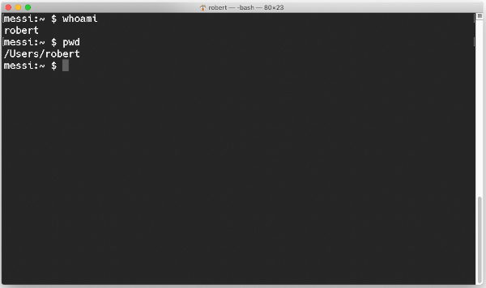
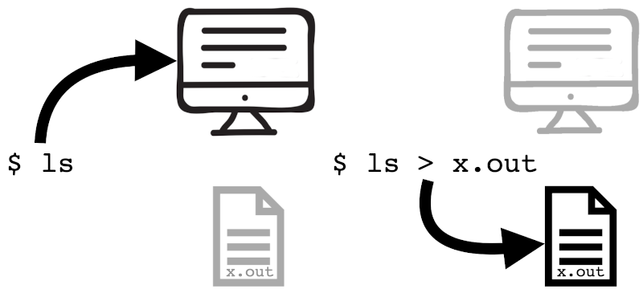

# Objectives

The learning objectives for this practical are:

 * Have your computer set up to work with the Unix command-line.
 * Download epidemiological data from the Catalan SIVIC network.
 * Create directories and navigate through the Unix filesystem.
 * Use the Unix online manual.
 * Copy, move and rename files.
 * Remove files and directories.
 * Explore file contents.
 * Redirect terminal output to a file.
 * Create your own GitHub profile.

# Setup and background

In this practical we will use some basic commands to navigate and manipulate the
Unix file system. You need to have access to a Unix
[command-line interface (CLI)](https://en.wikipedia.org/wiki/Command-line_interface).
If you are doing this practical in your own computer, please check the
[setup](/setup/) webpage to make sure that you have access to some flavor of a
Unix operating system and its CLI.

To practise working with files from the Unix CLI we will download
epidemiological data from the SIVIC network, the infection surveillance system
of Catalonia (_Sistema d'Informació per a la Vigilància d'Infeccions a
Catalunya -SIVIC_). The SIVIC network portal integrates data from primary care
centers (_Centres d'Atenció Primaria -CAPs_), clinical laboratories and
hospitals throughout the entire Catalonia; see the
[SIVIC help page](https://sivic.salut.gencat.cat/documentacio) and
[this infographic](Infografia_SIVIC_V4-CAT.pdf) (both in Catalan) for additional
information.

We will download two specific datasets from the SIVIC portal. Please follow the
next steps to successfully download them:

1. Go to the SIVIC portal at [https://sivic.salut.gencat.cat](https://sivic.salut.gencat.cat).
2. Click on the link located at the top-right of the page called "_Dades obertes_"
   ("open data").
3. In the next page, under the section title "_Dades obertes_", click on the
   link
   "_Vigilància microbiològica sentinella a Atenció Primària: mostres analitzades_"
   ("Primary care microbiological sentinel surveillance: analysed samples")
4. In the next page, click on the pull-down menu "_Exporta_".
5. In the pulled menu, click on the button labeled "CSV". At this point,
   depending on your browser configuration, either a pop-up window appeared that
   allows you to select where do you want to store this file, or the file has
   been automatically downloaded to a folder, typically called "Downloads", or
   "_Baixades_" in Catalan. If you are in this latter case and unsure where the
   file has been downloaded, click on the downloads button of your browser and
   you should be able to locate the file in the filesystem. **Please take note
   of the location and the name of the downloaded file, i.e., its path in the
   filesystem**.
6. Press the going back button in your browser and repeat steps 3 to 5, but
   this time following the link called
   "_Vigilància microbiològica sentinella a Atenció Primària: virus detectats_"
   ("Primary care microbiological sentinel surveillance: detected viruses").

The two files that you have downloaded should have the following names:

* `Vigil_ncia_microbiol_gica_sentinella_a_Atenci__Prim_ria__mostres_analitzades.csv`
* `Vigil_ncia_microbiol_gica_sentinella_a_Atenci__Prim_ria__virus_detectats.csv`

Note that these two filenames end with `.csv`. A suffix starting with a dot
(`.`) at the end of a filename is called its
[filename extension](https://en.wikipedia.org/wiki/Filename_extension) and, in
general, it gives us a hint on the type of contents that the file stores. For
instance, a file with extension `.jpg` stores an image in
[JPEG](https://en.wikipedia.org/wiki/JPEG) format, while a file with extension
`.mp4` stores a video in
[MP4](https://en.wikipedia.org/wiki/MP4_file_format) format. In our case, the
`.csv` extension indicates that the downloaded files have contents in the
so-called [CSV](https://en.wikipedia.org/wiki/Comma-separated_values) format.

Think about why the filenames of the CSV files we have downloaded have so many
underscore characters (`_`). **Tip**: checkout the concluding remarks of the
lecture on [Unix and the command line](https://funcompbio.github.io/lecture2).
Could you replace some of the underscore characters by something else?

# Creating your first directory

Open a terminal window and figure out which is your username and your default
current working directory (CWD) by
typing the commands `whoami` (first) and `pwd` (second) on the
[command prompt](https://en.wikipedia.org/wiki/Command-line_interface#Command_prompt).
After you type each command you should press the `Enter` key to ask the shell
to execute the command. Your interaction with the shell in the terminal window
should look similar to the following image.



The command prompt may display different information to the left of the cursor
and usually ends with the dollar sign. The solely purpose of the command prompt
is to indicate where we can start typing commands, while the purpose of the
cursor is to indicate that the shell is waiting for us to type commands. In the
image above the command prompt it is displaying the name of the host computer
(`messi`) and the the current CWD, which in this case corresponds to the
[_home_ directory](https://en.wikipedia.org/wiki/Home_directory)
and for this reason is abbreviated with the tilde `~`. In the image above the
home directory is `/Users/robert`, but tipically in a Unix system the home
directory would hang from a directory called `/home`.

Now, give the command to create a directory called `practical1`:

```
$ mkdir practical1
```

To check whether we have successfully created a directory called `practical1`
we can use the command `ls` and verify whether among the listed files we can
find the name `practical1`. The output of `ls` consists of the names of every
file in your current CWD. It may useful to distinguish between regular files
and directories, you can do that in different ways, one of them using the
option `-F`:

```
$ ls -F
```

You should see a trailing slash character `/` right after the name of each file
that is a directory, i.e., you should find for instance `practical1/`.

# Using the online manual

The Unix system has online manual pages for each of its commands, which can be
accessed through the command `man` giving as first argument the name of the
command for which you want to read its manual page. For instance, try to access
the manual page of the command `ls` by doing:

```
$ man ls
```

All manual pages have the same structure of sections `NAME`, `SYNOPSIS`,
`DESCRIPTION`, etc. and you can browse through it by using the `Enter` key to
scroll one line at a time, the `Space` key to scroll by page, the `b` key to
scroll one page backwards and the `q` key to quit the manual.

Similarly, you can obtain summary of the contents of the manual page by giving
the option `--help`:

```
$ ls --help
```

In fact, if you are on Windows using the Unix shell emulator _Git Bash_, you
will probably not be able to use the `man` command and only the latter option
will be available.

Using the manual page of the command `ls`, or the summary of its options,
checkout the meaning of the option `F`, and also try to understand how the
`mkdir` command is described. Make sure you understand what is said in the
section `NAME` of the manual page, or at the beginning of the output of option
`--help`.

# Changing the default path working directory 

We can change our default CWD to the new directory we have created before by
doing:

```
$ cd practical1
```

To check whether we have successfully changed the CWD to the new directory, use
again the command `pwd`. We can move back to the previous directory from where
we moved our default access by doing:

```
$ cd ..
```

Here the two consecutive dot characters `..` indicate the previous directory in
the filesystem hiearchy. You can check out again with `pwd` that after the
previous command you have come back to the directory from where you created
`practical1`.

# Copying files

Locate the path where you have downloaded the two SIVIC data files and use the
`ls` command to verify that they are indeed stored on that directory. If you
have downloaded the two files in a directory called **for instance** `Downloads`
located right below a home directory called **for instance** `/Users/robert`,
you can use the `ls` command as follows to check out the presence of those files
in that directory

```
$ ls /Users/robert/Downloads
```

It may happen that you have lots of other files on that directory and becomes
difficult to distinguish whether your files of interest are really there. In
this case, because the two filenames have extension `.csv`, you can use the
so-called
[_wildcard_ character](https://en.wikipedia.org/wiki/Wildcard_character) `*` to
restrict the file listing operation to those files having such an extension,
by typing on the command-line:

```
$ ls /Users/robert/Downloads/*.csv
```

This command should show you only those files whose filenames end with `.csv`,
which should be the two you have downloaded in this practical, and any other
previous file with extention `.csv` you had in that folder. Now, copy these
CSV files to your current brand new directory using the command `cp`.
**For instance**, if the files **were** located at

```
/Users/robert/Downloads
```

then, the command to copy one of these two files to the current CWD **would be**
(due to the length of the filename, you'll probably have to scroll the code
chunk to the right to see the entire command)

```
$ cp /Users/robert/Downloads/Vigil_ncia_microbiol_gica_sentinella_a_Atenci__Prim_ria__mostres_analitzades.csv .
```

**Important**: the dot character '.' in the second argument of the `cp` command,
indicates that the destination of the file is your current CWD. To copy the CSV
files into the directory `practical1` using '.' as destination,
**you need to make sure that `practical1` is your current CWD before writing the
command to copy the files**.

**Tip:** when writing long paths it is useful to exploit the so-called
_tab-completion mechanism_, which consists of pressing the `Tab` key (typically
located above the `Caps Lock` key) once you've written a few letters of a file
name in the path. If those few letters constitute a unique prefix of the
filename, the rest of the filename will be written for you by the shell. If the
prefix is not unique, by pressing the `Tab` key twice, the shell will show your
the two or more filenames that match that prefix. Actually, the tab-completion
mechanism also works for commands: if you type `cp` and press `Tab`, the shell
will show you all the available commands that start with `cp`.

Note that because `/Users/robert` corresponds in this example to the _home_
directory of the user, we could use the abbreviation `~`, corresponding to the
_home_ directory, to write the previous command line as

```
$ cp ~/Downloads/Vigil_ncia_microbiol_gica_sentinella_a_Atenci__Prim_ria__mostres_analitzades.csv .
```

Note that the previous command will work regardless of what is your username,
as long as the sought file is stored in the `Downloads` directory. **Tip:** In
keyboards with a Spanish layout, the tilde `~` character can be written by
pressing the keys `AltGr+4` in Windows and Ubuntu, or `Alt+n+space` in MacOS.

Now copy the second file. **Tip:** when you need to repeat a previous
command-line or your next command-line resembles pretty much a previous one,
you can use the up and down arrows to go through the history of all the
command-lines that you have typed before to either repeat it by pressing enter
or to modify it. In the previous case, you can recover the previous command-line
and replace the string `mostres_analitzades` by `virus_detectats`.

Please verify using the command `ls` that the two files are indeed in your
current CWD. If you have been successful, you have probably typed twice the `cp`
command. However, because the two filenames extension `*.csv`, you could have
done the job with one single command by using again the wildcard character `*`
as follows

```
$ cp /Users/robert/Downloads/*.csv .
```

# Moving or renaming files

Because you have **copied** the two files, after the copy operation, the files
remain intact in their original directory from where you have copied them, e.g.,
in `/Users/robert/Downloads` in the example above. A slightly different
operation is to **move** the files, because _moving_ removes the files from
their original location after they have been copied into their destination.
The command to move the files, instead of copy them, is `mv` with an analogous
syntax to `cp`.

You can also use the moving command `mv` to rename files. For instance, the
previously downloaded files have very long filenames, which makes them a bit
impractical to use them. Since most of the two filenames start with the same
text, we can rename the first of them to `mostres_analitzades.csv` as follows
(assuming the file is located in your CWD)

```
$ mv Vigil_ncia_microbiol_gica_sentinella_a_Atenci__Prim_ria__mostres_analitzades.csv mostres_analitzades.csv
```

Please rename the second one to `virus_detectats.csv`.

# Removing files

There are two commands to remove files. One is `rmdir` and the other is `rm`.
Check their respective manual pages and figure out what is the difference
between these two commands by reading only the `NAME` section.

We are going to illustrate the `rm` command as follows. Because we have copied
and renamed the downloaded data files, we can remove the files from their
original download location, this helps releasing space from our hard disk and
keeping tidy our downloads folder. To remove the first downloaded file, assuming
it was downloaded in `/Users/robert/Downloads`, we should type the following
command

```
$ rm ~/Downloads/Vigil_ncia_microbiol_gica_sentinella_a_Atenci__Prim_ria__mostres_analitzades.csv
```

Now remove the second file from the downloads folder and check out with the
command `ls` that they indeed have been removed. We could have also done this
operation in one single command using the wildcard character `*` as follows

```
$ rm ~/Downloads/*.csv
```

However, beware that this command would have removed **all** files with
extension `.csv` located in the `~/Downloads` folder, which would have included
the two we downloaded and any other file you previously had on that folder with
identical extension.

**WARNING**: the Unix system has no bin were removed files could go before being
finally removed by emptying the bin. If you accidentatlly remove a file through
the `rm` or the `rmdir` commands, **you cannot recover it**. Because of that,
you should pay attention when you use the wildcard character `*`, because an
unintended space character before or after the `*` could imply **removing all
files of your CWD or the target folder where you want to remove files**.

At this point, you have typed quite a few Unix commands and probably have the
terminal window full of text. Now and then you may want to clear the terminal
window. You can do that by either typing the command `clear` or pressing the
key combination `Ctrl+l`.

# Exploring file contents

The two SIVIC data files that we have successfully downloaded, copied into a
folder and renamed have filename extension `.csv`. This gives us two important
pieces of information about those two files:

  1. The two files are [text files](https://en.wikipedia.org/wiki/Text_file).
  2. The contents of those two files is in [CSV](https://en.wikipedia.org/wiki/Comma-separated_values)
     format.

The first point implies that we can inspect the contents of each of the files
from the command-line using any of the following Unix commands

  * `head filename`: shows the contents of the beginning of a file called
     _filename_.
  * `tail filename`: shows the contents of the end of a file called _filename_.
  * `cat filename`: shows the entire contents of a file called _filename_.
  * `more filename`: like `cat` but paginating the output. Use the `Enter` key
    to scroll line-by-line, the `Space` key to scroll by pages and the `q` key
    to quit. Modern Unix systems have also the command `less filename`, which
    works like `more` but also allows one to scroll the contents backwards using
    the key `b`.

The second point implies that the contents are organized as a table, where each
line contains a record of the data and each record consists of a given number of
values separated by some delimiter character, typically the comma character `,`
but also the semicolon `;`, sometimes the colon `:`, sometimes even the
[tab whitespace character](https://en.wikipedia.org/wiki/Tab_key#Tab_characters),
etc. In a CSV file, the first line may contain column names describing the kind
of values stored in the rest of the lines at the corresponding place.

Finally, a very useful command to summarize the contents of a text file is `wc`,
which provides the number of lines, words and characters in a text file. When
multiple files are given, either by specifying their names one after each other
or by using the wildcard character (e.g., `*.csv`), those statistics are given
for each file and also their grand totals. Please try the `wc` command on the
CSV SIVIC data files.

**WARNING:** All these commands to explore file contents may block the shell
waiting for content if you forget to specify a filename. In such a case, press
the combination of keys `Ctrl+d`, which send an
[end-of-file (EOF)](https://en.wikipedia.org/wiki/End-of-file) signal to the
command and will immediately exit, giving you back the control of the shell.

# Redirect terminal output to a file

A very useful feature of Unix is
[redirection](https://en.wikipedia.org/wiki/Redirection_%28computing%29),
sketched in the following picture



Here, we are going to see working example on what it means to redirect the
terminal output to a file. To redirect the terminal output to a file we use the
operator `>` as follows:

```
$ command > file
```
Here `command` is some program that generates output to the terminal window and
`file` is the name of the file where we want this output to be written. For
instance, try the following (it will only work if you did correctly all the
previous commands in this practical, otherwise the file
`mostres_analitzades.csv` will not be available for this example)

```
$ head mostres_analitzades.csv > test.txt
```
Note that you cannot see anymore the output of the `head` command on the
terminal window. However, if you use the commands `ls` and `cat test.txt`, you
should be able to identify a new file called `test.txt` and its contents
corresponding to the output of the `head` command.

Now, using this terminal output redirecting mechanism, create a file that
contains the number of lines of the two CSV SIVIC data files.

Using the `cat` command without a filename and the output redirection can also
be handy to quickly create a text file with a few words. For instance, type the
following:

```
$ cat > test.txt
Hello world!
```
Now press the EOF key combination (`Ctrl+d`) and verify that the previous
content of `test.txt` has dissapeared and instead it has now only the words
"Hello world!".

**Tip:** You should note that running twice the terminal redirection (`>`) over
the same file, overwrites completely the initial contents of the file. To avoid
overwritting the content of a file, and adding instead the new content at the
end, you should use `>>` instead of `>`.

# Create your own GitHub profile 

Go to [https://github.com](https://github.com) and create your own GitHub
profile by entering the following three bits of information in the sign up
form:

  * Email: enter your student UPF email (`xxxx.yyyy@estudiant.upf.edu`). It is
    important that you enter your student UPF email to enable the connection of
    your account with the GitHub Classroom organisation of FCB.
  * Password: enter a password according to the requirements shown in the form.
  * Username: you can write any word as username as long as it doesn't exist
    already as a username in GitHub. If you think you may be using this account
    professionally in the future, a popular choice is to write the first letter
    of your first name, followed by your family name.

On the next screen, answer the security question, if it appears, and press the
button **"Join a free plan"**.

On the next screen, answer the given questions as follows:

  * What kind of work do you do, mainly? **Student**
  * How much programming experience do you have? **None** (probably, but feel
    free to select another answer)
  * What do you plan to use GitHub for? select **School work and student
    projects** at least and feel free to select other answers.

Now check out your email, you should find a new one from GitHub where they ask
you to verify your email address. Follow the given link to do this step and your
browser should open on your brand new GitHub profile. You can now log out by
clicking on the icon at the top right corner of the GitHub page and select
`Sign out` from the pull down menu. **Do not forget your GitHub username and
password!!!**
